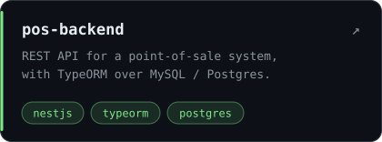
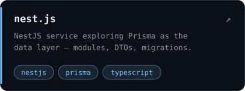
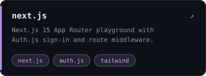
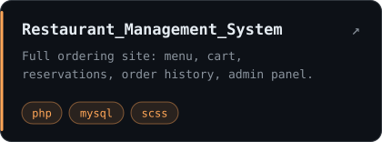

  

I'm Min, a web developer based in Yangon. At work I build products for **Myanmar Technology Gateway** and **Leap Technology**, mostly with Laravel and Vue, plus Ionic when something needs to live on a phone.

Outside of that I've been spending more of my time on the TypeScript side of the backend: NestJS, TypeORM and Prisma, with Next.js on the front. A few of the things I've been working on are below.

 

  
  
  
  

 

#### Tools I reach for

 

#### What I write most

<picture>
  <source media="(prefers-color-scheme: dark)" srcset="https://raw.githubusercontent.com/Khant135/Khant135/output/github-snake-dark.svg" />
  
</picture>
